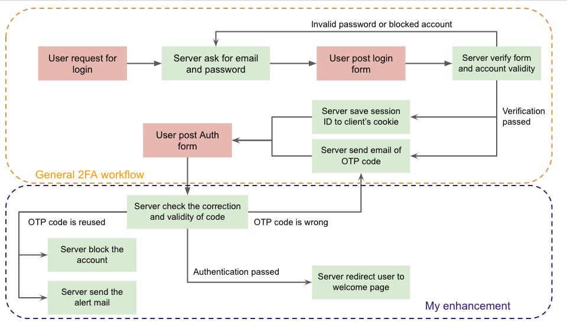
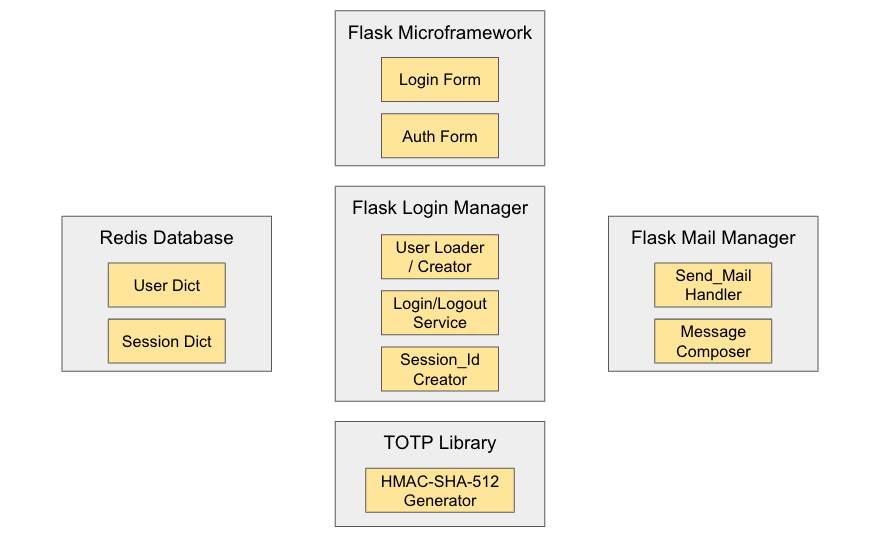

# OTP-Semaphore




### Step 0-a.
#### In ENV_VAR file, fill up the environment values from "MAIL_SERVER" to "MAIL_PASSWORD". You can refer the tutorial from the mail service provider.
```
$ cd Artifacts
$ vim ENV_VAR
```
```
export MAIL_SERVER=your_mail_smtp_server
export MAIL_PORT=your_smtp_port #Maybe 465 or 25
export MAIL_USE_SSL=1 #or MAIL_USE_TLS=1. Depends on your service provider
export MAIL_USERNAME=your_username
export ADMIN=your_email_account
export MAIL_PASSWORD=your_password
```

### Step 0-b.
#### Create environment variables and check the values.
```
$ source ENV_VAR
$ echo $MAIL_SERVER
```
### Step 1.
#### Prepare the python virtual environment for flask and redis. Please refer to the following site for install and initiate redis server.
https://redis.io/topics/quickstart
```
$ virtualenv env
$ source env/bin/activate
(env) $ pip install flask flask-login flask-mail 
(env) $ pip install flask-wtf wtforms werkzeug redis
```
### Step 2.
#### Execute the application and launch a browser for test.
```
(env) $ cd app
(env) $ python interface.py
 * Serving Flask app "interface" (lazy loading)
 * Environment: production
   WARNING: Do not use the development server in a production environment.
   Use a production WSGI server instead.
 * Debug mode: off
 * Running on http://127.0.0.1:5000/ (Press CTRL+C to quit)
```

### Step 3.
#### Sign up with your mail account and try login and logout on multiple browsers simultaneously. TOTP code would be sent to your email account.

### Screenshot of application layout


Please drop mail to ykao@cs.stonybrook.edu, thanks.
